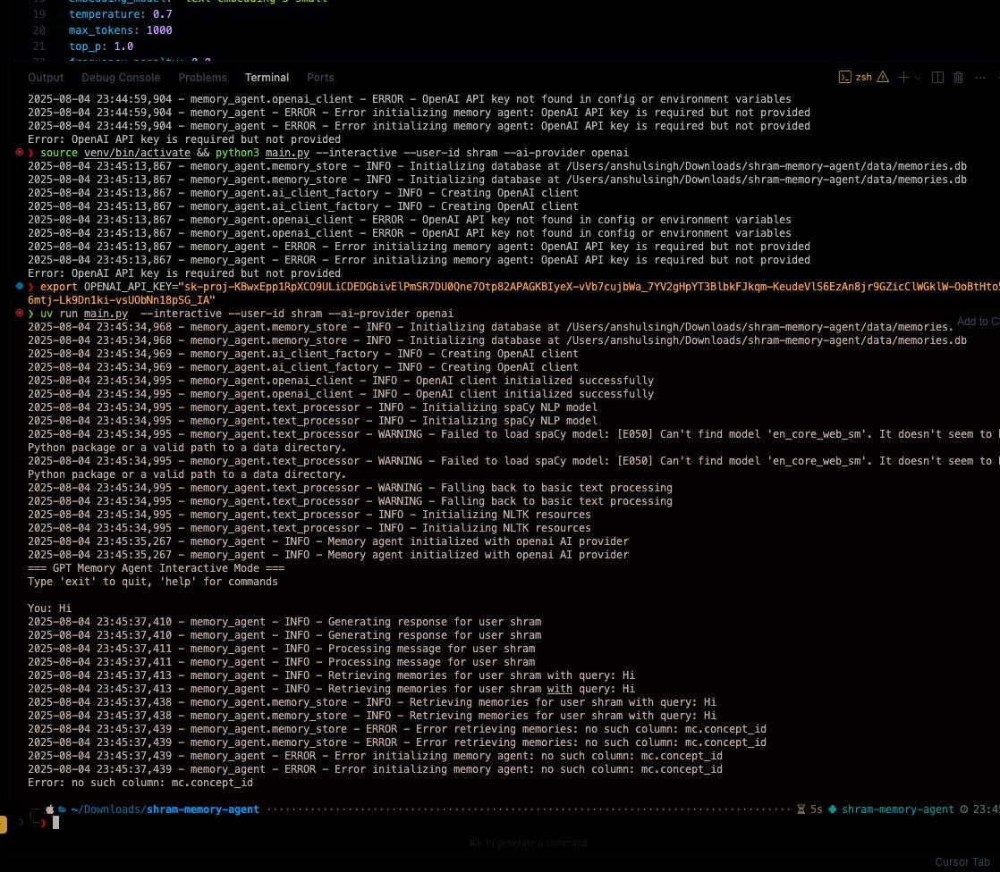
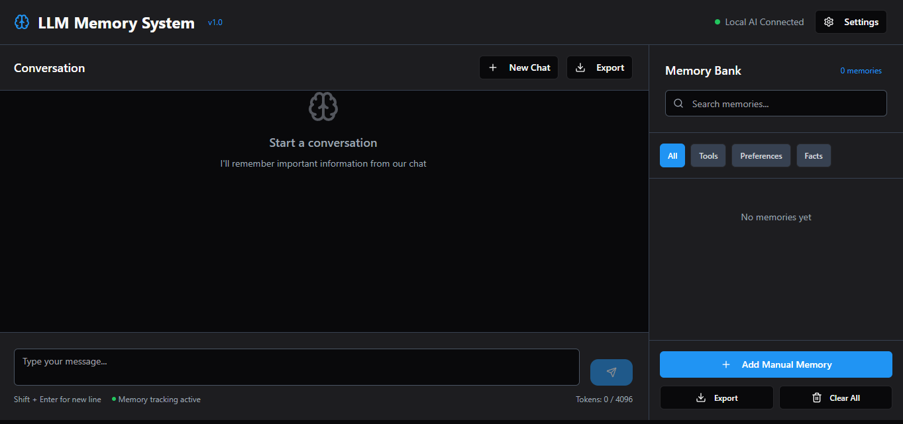
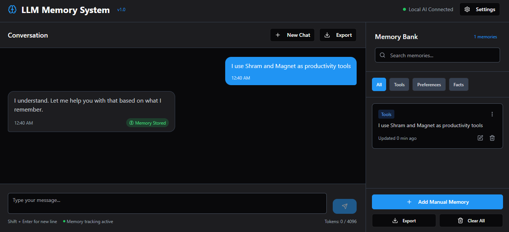
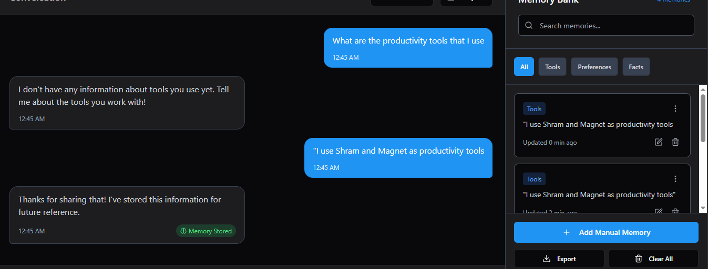

# GPT Memory Agent

A long-term memory system for Large Language Models (LLMs) using OpenAI APIs or Puter.js. This project implements a memory management system that allows LLMs to store, retrieve, and manage memories about users across conversations.

## Features

- **Memory Recording**: Automatically extracts and stores important information from user messages
- **Memory Retrieval**: Retrieves relevant memories based on conversation context
- **Memory Management**: Prioritizes memories by importance and manages memory lifecycle
- **Conversation Context**: Enhances responses with relevant memories from past interactions
- **Memory Deletion**: Supports explicit memory deletion requests from users
- **API Interface**: Provides a RESTful API for integration with other applications
- **Command-line Interface**: Offers an interactive mode for direct usage

## Architecture

The GPT Memory Agent consists of several key components:

1. **Memory Agent**: The core orchestrator that manages the memory operations and AI API interactions
2. **Memory Store**: Handles memory storage, retrieval, and management using SQLite
3. **Text Processor**: Analyzes text, extracts memories, and processes semantic information
4. **AI Client**: Manages interactions with the OpenAI API or Puter.js for generating responses and embeddings
5. **Config**: Manages application settings and configuration
6. **API**: Provides a FastAPI interface for external applications

## How It Works

1. **Memory Extraction**:
   - User messages are processed to extract potential memories
   - Each memory is evaluated for importance and relevance
   - Valid memories are stored in the database with metadata

2. **Memory Retrieval**:
   - When generating a response, the system retrieves relevant memories
   - Memories are selected based on semantic similarity to the current context
   - The most important and relevant memories are included in the context

3. **Response Generation**:
   - Retrieved memories are formatted and included in the prompt to the LLM
   - The LLM generates a response informed by these memories
   - The system tracks which memories were used

4. **Memory Management**:
   - Memories are prioritized by importance and recency
   - Less important memories may be pruned over time
   - Users can request explicit deletion of specific memories

## Getting Started

### Prerequisites

- Python 3.8 or higher
- OpenAI API key (if using OpenAI as the AI provider)
- Web browser with JavaScript support (if using Puter.js as the AI provider)

### Installation

1. Clone the repository:
   ```bash
   git clone https://github.com/yourusername/gpt-memory-agent.git
   cd gpt-memory-agent
   ```

2. Install dependencies:
   ```bash
   pip install -r requirements.txt
   ```

3. Set up your environment variables:
   ```bash
   cp .env.example .env
   # Edit .env to add your OpenAI API key (if using OpenAI as the AI provider)
   ```

4. Install the required spaCy model:
   ```bash
   python -m spacy download en_core_web_sm
   ```

### Usage

#### Command-line Interface

Run the agent in interactive mode:

```bash
python main.py --user_id your_user_id
```

This will start an interactive session where you can chat with the agent.

#### API Server

Start the API server:

```bash
python -m src.api
```

The API will be available at `http://localhost:8000`.

#### API Client

You can use the provided API client to interact with the agent:

```python
from examples.api_client import MemoryAgentClient

client = MemoryAgentClient("http://localhost:8000")
response = client.generate_response("your_user_id", "Hello, do you remember me?")
print(response["response"])
```

#### Basic Usage Example

```python
from src.memory_agent import MemoryAgent

# Initialize the agent
agent = MemoryAgent()

# Process a message to store memories
result = agent.process_message("user123", "My name is John and I like pizza.")
print(f"Stored {len(result['stored_memories'])} memories")

# Generate a response with memory context
response = agent.generate_response("user123", "What's my favorite food?")
print(response["response"])
```

## Configuration

The agent can be configured using a YAML file. See `config/default_config.yaml` for available options.

You can specify a custom configuration file when starting the agent:

```bash
python main.py --config path/to/your/config.yaml
```

### AI Provider Configuration

You can choose between OpenAI and Puter.js as your AI provider by setting the `ai_provider` option in your configuration file:

```yaml
# AI Provider setting
ai_provider: "openai"  # Options: "openai", "puter"
```

When using Puter.js, you don't need an API key as it provides free, serverless access to AI models directly from your browser.

## Project Structure

```
gpt-memory-agent/
├── config/                 # Configuration files
│   └── default_config.yaml # Default configuration
├── data/                   # Data storage directory
├── examples/               # Example usage scripts
│   ├── api_client.py       # API client example
│   ├── basic_usage.py      # Basic usage example
│   └── puter_web_demo.html # Web demo using Puter.js
├── src/                    # Source code
│   ├── ai_client_factory.py # Factory for creating AI clients
│   ├── api.py              # FastAPI implementation
│   ├── config.py           # Configuration management
│   ├── memory_agent.py     # Core memory agent
│   ├── memory_store.py     # Memory storage and retrieval
│   ├── openai_client.py    # OpenAI API client
│   ├── puter_client.py     # Puter.js client
│   └── text_processor.py   # Text analysis and processing
├── tests/                  # Unit tests
├── .env.example           # Example environment variables
├── main.py                # Command-line interface
└── requirements.txt       # Dependencies
```

## Testing

Run the tests with pytest:

```bash
python -m pytest
```

Or with coverage:

```bash
python -m pytest --cov=src tests/
```

## License

This project is licensed under the MIT License - see the LICENSE file for details.


## Screenshots 







## Acknowledgements

- OpenAI for providing the API that powers this project
- Puter.js for providing free, serverless access to AI models
- The FastAPI framework for the API implementation

- spaCy and NLTK for natural language processing capabilities
